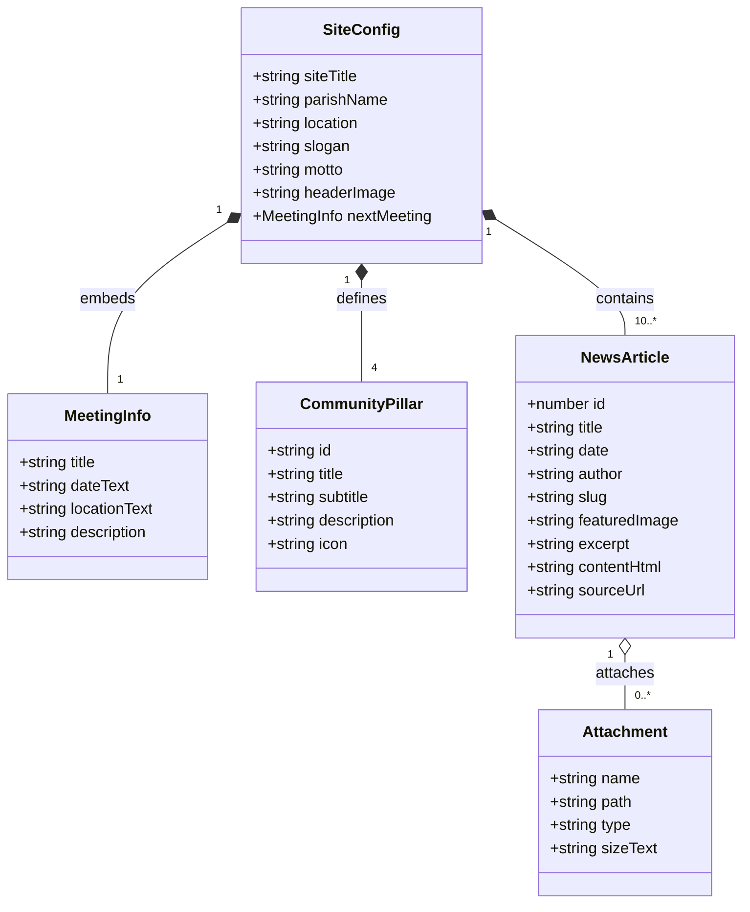

# Data Model: Wspólnota Rodzin Mobile Website

**Feature**: `001-wspolnota-rodzin-website`  
**Date**: 2026-09-19  

## Overview

The data model defines the structured entities stored in `data/content.json` that power the website. This schema is designed specifically for clarity, schema validation, and frictionless editing by AI agents.

---

## Entities

### 1. SiteConfig & CommunityHeader

Represents the overall community branding, identity, and header content displayed at the top of the mobile canvas.

| Field | Type | Required | Description | Example |
|-------|------|----------|-------------|---------|
| `siteTitle` | string | Yes | Title used in `<title>` and header | `"Wspólnota Rodzin – Kozanów"` |
| `parishName` | string | Yes | Full parish name | `"Parafia pw. św. Jadwigi Śląskiej"` |
| `location` | string | Yes | City & neighborhood | `"Wrocław – Kozanów"` |
| `slogan` | string | Yes | Header slogan | `"Razem w wierze, w miłości, na co dzień"` |
| `motto` | string | Yes | Community banner motto | `"Bo rodzina to wielki dar"` |
| `headerImage` | string | Yes | Relative path to header visual | `"assets/images/header/wspolnota-baner.jpg"` |
| `nextMeeting` | object | Yes | Next scheduled community event | See `MeetingInfo` below |

### 2. MeetingInfo

Describes the upcoming gathering highlighted in the header tiles.

| Field | Type | Required | Description | Example |
|-------|------|----------|-------------|---------|
| `title` | string | Yes | Short title of gathering | `"Najbliższe spotkanie wspólnoty"` |
| `dateText` | string | Yes | Human-readable date & time | `"Niedziela, 20 września, godz. 16:00"` |
| `locationText` | string | Yes | Meeting room / venue | `"Salka parafialna pod kościołem"` |
| `description` | string | No | Short agenda or encouragement | `"Zapraszamy wszystkie rodziny z dziećmi!"` |

### 3. CommunityPillar

Represents the 4 core pillars displayed in the interactive tile grid.

| Field | Type | Required | Description | Example |
|-------|------|----------|-------------|---------|
| `id` | string | Yes | Unique identifier | `"spotkania"`, `"modlitwa"`, `"relacje"`, `"termin"` |
| `title` | string | Yes | Pillar headline | `"Wspólne Spotkania"` |
| `subtitle` | string | Yes | Pillar sub-tagline | `"Modlitwa • rozmowa • wsparcie"` |
| `description` | string | Yes | Full description for modal / expandable view | `"Spotykamy się regularnie, by dzielić się wiarą..."` |
| `icon` | string | Yes | Semantic icon name or SVG path | `"users"`, `"heart"`, `"church"`, `"calendar"` |

### 4. NewsArticle

Represents an individual news announcement or reflection, populated with the 10 entries from `news_reference`.

| Field | Type | Required | Description | Example |
|-------|------|----------|-------------|---------|
| `id` | number / string | Yes | Unique numeric or slug ID | `19372` or `"01-spotkania-u-sw-jadwigi"` |
| `title` | string | Yes | Article headline | `"Spotkania u św. Jadwigi"` |
| `date` | string | Yes | ISO publication date (`YYYY-MM-DD`) | `"2026-09-14"` |
| `author` | string | No | Author name (defaults to "Redakcja") | `"Piotr"` |
| `slug` | string | Yes | URL-friendly slug | `"spotkania-u-sw-jadwigi"` |
| `featuredImage` | string | No | Relative path to featured image | `"assets/news/01/IMG-20260913-WA0001.jpg"` |
| `excerpt` | string | Yes | 1-2 sentence preview text | `"Zapraszamy na cykliczne spotkania..."` |
| `contentHtml` | string | Yes | Formatted article body HTML | `"
Drodzy Parafianie...
"` |
| `sourceUrl` | string | No | Original URL on parish website | `"https://www.jadwigakozanow.pl/spotkania-u-sw-jadwigi/"` |
| `attachments` | array | No | List of downloadable files | See `Attachment` below |

### 5. Attachment

Represents downloadable documents accompanying an announcement.

| Field | Type | Required | Description | Example |
|-------|------|----------|-------------|---------|
| `name` | string | Yes | Display title | `"Oświadczenie KEP (PDF)"` |
| `path` | string | Yes | Relative path to file | `"assets/news/03/Oswidczenie-KEP.pdf"` |
| `type` | string | Yes | MIME type or extension | `"pdf"` |
| `sizeText` | string | No | Approximate file size | `"249 KB"` |

---

## Entity Relationship Diagram

---

## Validation Rules

1. **Ordering**: `NewsArticle` items must be listed in descending order by `date`.
2. **Path Safety**: All image and document paths must be local and relative (never starting with `http://` or `/`).
3. **Encoding**: Character encoding is strictly UTF-8 to preserve all Polish diacritics (`ą, ć, ę, ł, ń, ó, ś, ź, ż`).
4. **Resilience**: If an article does not contain a `featuredImage`, the UI must render a clean typography-focused tile without broken image artifacts.
